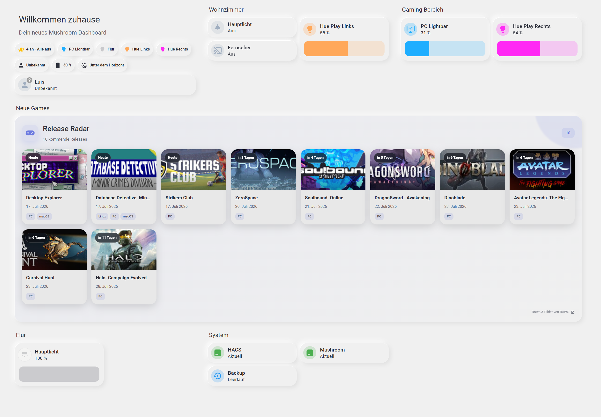

# Game Releases for Home Assistant

[](https://github.com/toonymak1993/ha-game-releases/releases)
[](https://github.com/toonymak1993/ha-game-releases/actions/workflows/validate.yml)
[](LICENSE)

A lightweight Home Assistant integration and modern Lovelace card for popular upcoming PC game releases. It requires no account, API key, container, or secondary service.



> The screenshot was captured from an early UI build and still shows the former RAWG attribution in the footer. Version 0.2.0 and newer use the Steam storefront only; RAWG is not used and no RAWG account is required.

## How it works

The integration requests Steam's public **Popular Upcoming** storefront feed every six hours. The response is normalized into a small release model and exposed to Home Assistant in two ways:

- `sensor.game_releases_upcoming_releases` contains the release count and a `games` attribute with names, dates, cover images, platforms, and Steam links.
- `calendar.game_releases_release_calendar` exposes the same releases as native all-day calendar events.
- `custom:game-releases-card` reads the sensor attributes and renders the responsive Release Radar shown above.

The dashboard card follows Home Assistant theme variables, so it works with light and dark themes, Mushroom dashboards, and themes such as NeuMorphix. On phones the game tiles become a horizontal swipe row.

## Features

- Popular upcoming Steam releases instead of an unfiltered catalogue
- No account, API key, credentials, or cloud setup
- Configurable look-ahead period and number of releases
- Native Home Assistant sensor and calendar entities
- Responsive Lovelace card with covers, countdowns, and platform chips
- Six-hour coordinator refresh
- German and English setup translations
- Diagnostics without credentials or private data

## Install with HACS

Until the repository is included in the default HACS catalogue, add it as a custom repository:

1. Open **HACS → Integrations**.
2. Open the three-dot menu and choose **Custom repositories**.
3. Add `https://github.com/toonymak1993/ha-game-releases` with category **Integration**.
4. Search for **Game Releases** and install it.
5. Restart Home Assistant.
6. Open **Settings → Devices & services → Add integration → Game Releases**.
7. Choose the look-ahead period and maximum number of releases.

## Add the dashboard card

Add `/game_releases/game-releases-card.js?v=0.2.0` as a JavaScript module under **Settings → Dashboards → Resources**.

Then add this YAML card:

```yaml
type: custom:game-releases-card
entity: sensor.game_releases_upcoming_releases
title: Release Radar
limit: 10
```

The exact entity ID can differ when Home Assistant resolves a naming collision.

## Manual installation

1. Copy `custom_components/game_releases` into `/config/custom_components/`.
2. Restart Home Assistant.
3. Add the **Game Releases** integration.
4. Follow the dashboard-card steps above.

## Data source and scope

Version 0.2.0 uses the public Steam storefront search and therefore focuses on PC releases. Results are filtered to releases with a concrete date inside the configured period. Titles without a specific date such as “Coming soon” are intentionally skipped.

Steam, game names, cover images, and storefront data remain the property of their respective owners. This project is not affiliated with or endorsed by Valve Corporation.

## Development

```bash
python -m unittest discover -s tests -v
python -m compileall -q custom_components tests
node --check custom_components/game_releases/frontend/game-releases-card.js
```

Bug reports and feature requests are welcome in [GitHub Issues](https://github.com/toonymak1993/ha-game-releases/issues).

## License

MIT. See [LICENSE](LICENSE).
